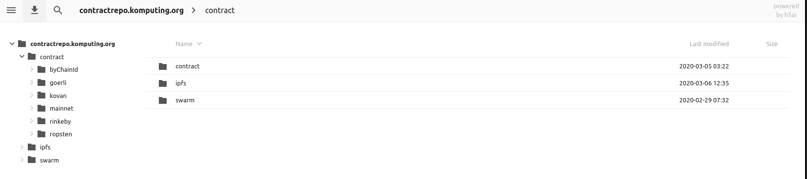
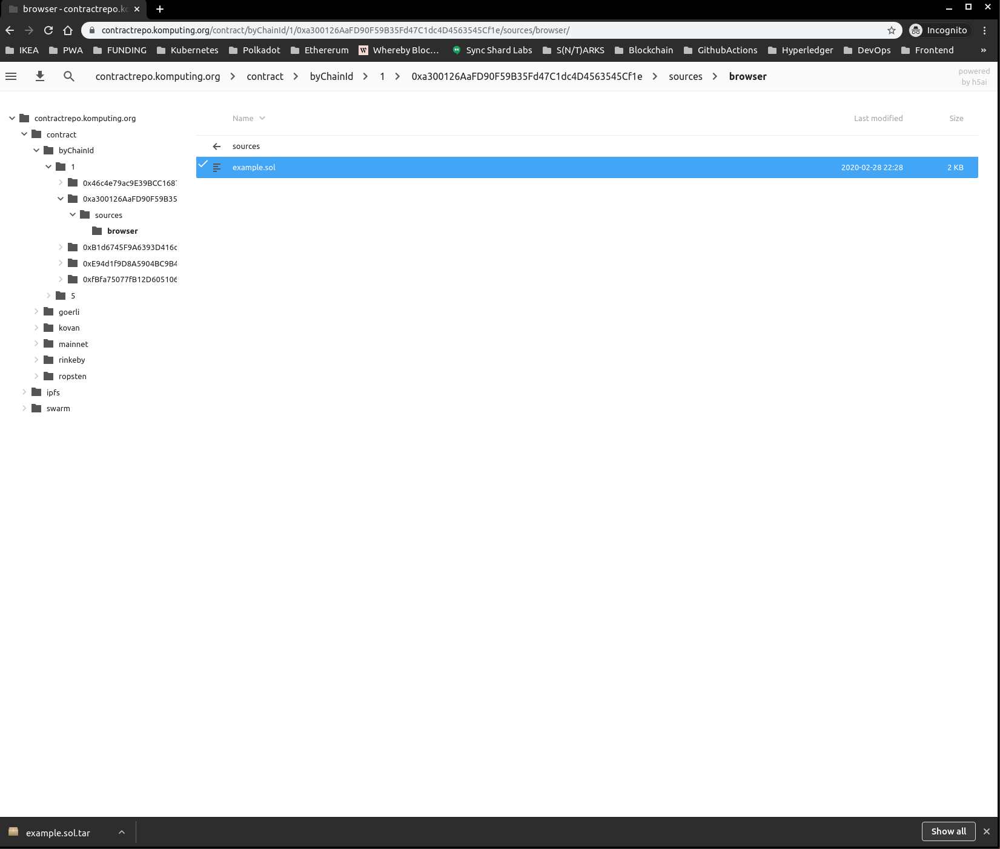
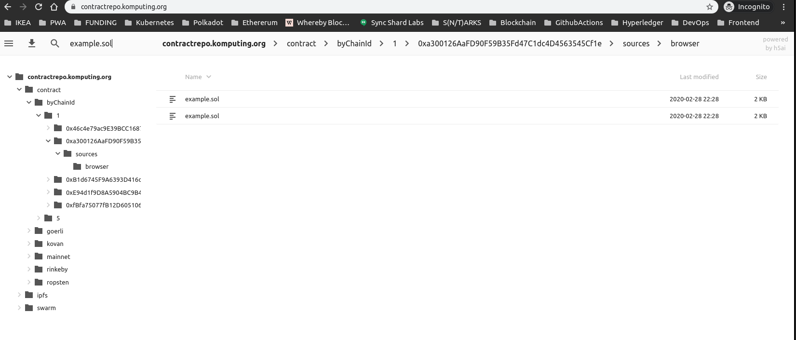
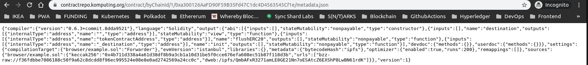

# Sourcify 🧑‍💻📝🔍

Sourcify wants to help make contract interactions on the blockchain safer and more transparent for users.

To achieve this goal, Sourcify supports several efforts to foster adoption of open-source source file verification, metadata files and NatSpec comments.

**ℹ️ [This repository](https://github.com/ethereum/sourcify) only contains the main components, the Sourcify monorepo with main services and the verification UI. The [Sourcify Github organization](https://github.com/sourcifyeth) contains all other auxiliary services and components.**

At its core, Sourcify currently maintains:

- an [interface](https://github.com/sourcifyeth/sourcify/tree/master/ui) that helps developers to verify metadata and contract source code. It is accessible via [sourcify.dev](https://sourcify.dev/).
- a decentralized contract repository of all verified contracts, powered by IPFS, accessible via [sourcify.dev](https://sourcify.dev/) and [verificat.eth](verificat.eth.link).
- a monitoring & verifier service that checks for new contracts on selected EVM-compatible chains and tries to verify them automatically.
- verify & fetch plugins for several IDEs.

Sourcify aims to provide a base layer allowing other tools build on top of it. Its main purpose is to keep metadata and source files available via IPFS and Swarm (preventing that the links in the bytecode turn into dead links).

Besides the technical infrastructure, Sourcify is also a collective initiative to bring transparency and awareness to the space. We want to educate and build bridges between development tools, wallets, interfaces and other components which all play an important role in demystifying interaction with smart contracts for the end user and hence making blockchain interactions safer.

**Have questions or improvement ideas?**

💬 Chat with us on [Gitter](https://gitter.im/ethereum/source-verify) or [Discord](https://discord.gg/8WEykm2aHC) (channels are bridged).

🌐 Follow us and help us spread the word on [Twitter](https://twitter.com/SourcifyEth).

## The Basic Concept

Sourcify verifies that Ethereum bytecode was compiled from a certain
Solidity source code and maintains a public repository of contract metadata.

The repository indexes metadata with IPFS or Swarm hashes which the solc compiler
embeds in contract bytecode. By fetching code on-chain and extracting this hash,
it is possible to obtain related metadata from Sourcify's records.

Read more about Sourcify in the [FAQ](https://solidity.ethereum.org/2020/06/25/sourcify-faq/).
Information on metadata can be found in [Solidity documentation][30].

[30]: https://solidity.readthedocs.io/en/latest/metadata.html#contract-metadata

## The Technical Details

As mentioned above, Sourcify has several components:

- a "monitoring & verifier service" which watches public Ethereum networks for contract deployments
  and tries to associate them with sources and metadata published to Swarm or IPFS. It currently
  watches Ethereum mainnet and test networks, and other EVM based chains listed [here](#supported-networks)

- a website which allows you to submit sources and metadata for a specific contract address manually

  - https://sourcify.dev (Stable)
  - https://staging.sourcify.dev (Unstable)
  - https://draft.staging.sourcify.dev (New UI design)

- a public metadata repository that contains uploaded (or discovered) metadata and their sources:
  - https://repo.sourcify.dev (Stable)
  - https://repo.staging.sourcify.dev (Unstable)

### Getting Metadata

Using solc directly on the commandline:

```
solc --metadata --metadata-literal <mySource.sol>
```

or with JSON/IO

```
{
  "settings": {
    "metadata": { "useLiteralContent": true }
  }
}
```

### Using the Monitoring Service

If your Solidity code compiles with solc >= 0.6.0, all you need to do is to upload your
contract metadata and sources to IPFS as part of your deployment process. The monitoring service will
automatically add your files to the metadata repository when it sees your contract created on the
network.

A simple example for Truffle projects can be found at [cgewecke/metacoin-source-verify][40]
which contains [a script][41] to publish to IPFS directly from a Truffle compilation artifact.

[40]: https://github.com/cgewecke/metacoin-source-verify
[41]: https://github.com/cgewecke/metacoin-source-verify/blob/master/scripts/ipfs.js

### Security Precautions

Please note that source code verification is only reliable if it is performed
on the **creation** bytecode, i.e. the bytecode payload used when the contract
was created. The deployed bytecode, i.e. the bytecode stored in the blockchain
as code is not sufficient, because the constructor can still be different and
set arbitrary storage entries.

Furthermore, if the constructor requires parameters, these have to be checked
as well.

Also note that there can still be differences in the source code that are not
visible in the bytecode. Variables can be renamed or unused code can be
introduced. Since the bytecode contains a hash of the source code, such
modifications have to be prepared at deploy time, but it is still a possibility.

### Pinning the Repository on IPFS

Pin and help us decentralize the Sourcify repository!

Refer to [the guide](https://github.com/wmitsuda/otterscan/blob/develop/docs/ipfs.md#pinning-sourcify-locally) by @wmitsuda

### Using the Repository

There is a repository which contains all the files that the monitoring service has found
on the networks that are being watched.

The repository is accessible via this [link](https://repo.sourcify.dev/).

The repository UI currently looks like this:


It offers the option to search, download or open folders.

For example to download:



Or if you want to search something:



The metadata inside is visible as raw, and can be downloaded like that:



Alternatively, if you want to take a look at the contract in the browser, you can open it like this:


## Future Plans

- cope with metadata that does not have in-place source code
- automatically retrieve the metadata and the source code from SWARM or IPFS,
  so you only need to supply the metadata hash or bytecode
- perform source verification given only an address instead of the bytecode
  or the metadata

### How to

## Install and run server with UI

```
$ npx lerna bootstrap
$ npx lerna run build
$ npm run server:start
$ npm run dev:ui
```

## Run inside docker

### Prerequisites

[Docker](https://docs.docker.com/docker-for-mac/install/)

[Docker-compose](https://docs.docker.com/compose/install/)

### How to run

Prepare environment and start by running these commands from the `environments` directory:
To build images locally run:
`docker-compose -f geth.yaml -f ipfs.yaml -f localchain.yaml -f monitor.yaml -f repository.yaml -f s3.yaml -f server.yaml -f ui.yaml -f build-ipfs.yaml -f build-localchain.yaml -f build-monitor.yaml -f build-repository.yaml -f build-s3.yaml -f build-server.yaml -f build-ui.yaml build --parallel`

If you just want to run it do:
`docker-compose -f ipfs.yaml -f localchain.yaml -f monitor.yaml -f repository.yaml -f s3.yaml -f server.yaml -f ui.yaml up -d` (-d flag means that output won't be printed in stdout)

Note: you don't need to run all the services, just the ones you want.

### How to run

## Development

**Launch**

```
cp .env.testing .env
docker-compose -f ipfs.yaml -f localchain.yaml -f monitor.yaml -f repository.yaml -f s3.yaml -f server.yaml -f ui.yaml up -d
```

Other approach would be to run every service in docker except one that you are working on.

This will build the project in docker containers, launching the monitor and server.
Verified sources and contract addresses will be stored in `repository` and `db` folders
in your project root. The directories are created automatically if they don't exist.

`/ui/dist/index.html` will be served to **http://localhost:1234**

**UI**

To help with manual UI testing, some contracts whose sources and metadata can be found in the
`test/sources/all` folder are automatically deployed to a local ganache instance running
on port 8545. Their contract addresses are deterministically generated at:

| Contracts            | Addresses                                  |
| -------------------- | ------------------------------------------ |
| Simple.sol           | 0x8168f192F7432C93FCb16e039B57FB890AaB3230 |
| SimpleWithImport.sol | 0x0Ef7de872C7110d6020fa5e62d7cD31Fd90FF811 |

Similar sources are also pre-deployed to **Ropsten** and can be found in the `test/sources/ropsten` folder:

| Contracts            | Addresses                                  |
| -------------------- | ------------------------------------------ |
| Simple.sol           | 0xEB6Cf7952c666F81f1a5678E80D4fC5Ce3a7bF0b |
| SimpleWithImport.sol | 0x4668b709182F41837c4e06C8de1D3568df7778D9 |

**Shutdown**
Stop the docker run with `ctrl+c`.
To remove exited containers type `docker-compose -f server.yaml -f ... down`. You can list all previously started containers with `-f` flag.

### Tests

Run tests with:

```
lerna run test
```

`test/sources` contains contracts, compilation artifacts and metadata files which can be used for
building test cases.

- **contracts/**: Solidity files (browser tests)
- **metadata/**: raw metadata files (browser tests)
- **pass/**: compilation artifacts which should verify (unit tests)
- **fail/**: compilation artifacts which should not verify (unit tests)
- **compiler.json**: compiler config for generating more cases

Test sources are compiled with 0x's [sol-compiler][22]. This lets you pick any compiler version or
settings by modifying the `compiler.json` file as needed.

To generate more test data, go to the `test/sources` directory, add Solidity files to the
`contracts` folder and run:

```
npx sol-compiler
```

Compilation artifacts will be written to an `artifacts` folder.

[22]: https://sol-compiler.com/

# API

We also provide publicly available API for both environments that you can use.
You can find examples in our Postman collection in the root of this project `Sourcify.postman_collection.json`.

### Server API

- [Check by addresses](docs/api/server/verification1/check-by-addresses.md) : `GET /check-by-addresses?addresses={address}&chainIds={chainIds}`
- Verification API (v1)
  - [Verify](docs/api/server/verification1/verify.md) : `POST /` or `POST /verify`
- Verification API (v2 - session based)
  - [Add input files](docs/api/server/verification2/input-files.md) : `POST /input-files`
  - [Verify validated](docs/api/server/verification2/verify-validated.md) : `POST /verify-validated`
  - [Get session data](docs/api/server/verification2/session-data.md) : `GET /session-data`
  - [Restart session](docs/api/server/verification2/restart-session.md) : `POST /restart-session`
- [Get file tree (full match)](docs/api/server/getTreeByChainAndAddress.md) : `GET /files/tree/:chain/:address`
- [Get source files (full match)](docs/api/server/getByChainAndAddress.md) : `GET /files/:chain/:address`
- [Get file tree (full or partial match)](docs/api/server/getAnyTreeByChainAndAddress.md) : `GET /files/tree/any/:chain/:address`
- [Get source files (full or partial match)](docs/api/server/getAnyByChainAndAddress.md) : `GET /files/any/:chain/:address`
- [Get contract addresses (full or partial match)](docs/api/server/getContractsByChain.md) : `GET /files/contracts/:chain`
- [Server health](docs/api/server/health.md) : `GET /health`

### Repository API

This paragraph should be read with the following in mind:

- `<MATCH_QUALITY>` is either `full_match` or `partial_match`.
- `<CHAIN_ID>` is the respective ID of the chain (e.g. 1 for Ethereum Mainnet, 5 for Görli). See the full list [here](https://chainid.network/).
- `<CONTRACT_ADDRESS>` is the hexadecimal address of the contract (40 hex digits prefixed by `0x`).
- `<FILE_PATH>` is the original path of a source file. Sourcify doesn't flatten the file hierarchy, so everything is provided as during compilation.

The repository (https://repo.sourcify.dev) provides the following GET endpoints:

- JSON-formatted metadata file (with ABI): `/contracts/<MATCH_QUALITY>/<CHAIN_ID>/<CONTRACT_ADDRESS>/metadata.json`
- JSON-formatted file with constructor arguments (only for fully matched contracts using [immutable variables](https://ethereum.stackexchange.com/questions/82240/what-is-the-immutable-keyword-in-solidity)): `/contracts/full_match/<CHAIN_ID>/<CONTRACT_ADDRESS>/constructor-args.txt`
- JSON-formatted file mapping library address placeholders to actual addresses: `/contracts/<MATCH_QUALITY>/<CHAIN_ID>/<CONTRACT_ADDRESS>/library-map.json`
- Source file: `/contracts/<MATCH_QUALITY>/<CHAIN_ID>/<CONTRACT_ADDRESS>/sources/<FILE_PATH>`
- JSON-formatted full and partial match count per chain: `/stats.json`
- JSON-formatted timestamp and version of the repo: `/manifest.json`

E.g. the following URL fetches `browser/OceanMan.sol`, a source of the contract deployed on Ethereum Mainnet (chain ID: 1) at address 0x00000000064Ecc11c97AC4a5551F279532Bf9E0D.

- https://repo.sourcify.dev/contracts/full_match/1/0x00000000064Ecc11c97AC4a5551F279532Bf9E0D/sources/browser/OceanMan.sol

In order to fetch from the staging repository, replace https://repo.sourcify.dev with https://repo.staging.sourcify.dev.

# Supported Networks

- Ethereum Mainnet
- Ropsten
- Rinkeby
- Kovan
- Goerli
- xDai
- POA Network Sokol
- Polygon (previously Matic)
- Mumbai Testnet (Polygon/Matic)
- Binance Smart Chain Mainnet (monitoring temporarily suspended)
- Binance Smart Chain Testnet (monitoring temporarily suspended)
- Celo Mainnet
- Celo Alfajores Testnet
- Celo Baklava Testnet
- Avalanche Mainnet
- Avalanche Fuji Testnet
- Arbitrum Mainnet
- Arbitrum Testnet Rinkeby
- Ubiq
- OneLedger Testnet Frankenstein
- Syscoin Tanenbaum Testnet
- Optimistic Ethereum Mainnet
- Optimistic Ethereum Kovan Testnet
- Boba Network Mainnet
- Boba Network Rinkeby Testnet
- Velas EVM Mainnet
- Meter Mainnet

## Adding a new chain

If you'd like to add a new chain support to Sourcify you can open a pull request to the **staging** branch with following:

- Make sure the chain is listed in [chains.json](services/core/src/chains.json). This file is kept in sync with [chainlist.org](https://chainlist.org/chains.json) and should not be edited.

- Add the chain details in [sourcify-chains.ts](services/core/src/sourcify-chains.ts) similar to other chains with `supported: true` and `monitored: false`.

- Add the chain to the front-end in [constants.ts](ui/src/common/constants.ts)

- Provide a test contract on the chain with address, source code, and metadata file in the pull request.

# Contributing

When opening a pull request, please set the base branch as **staging**. Direct merges to master is not possible.
